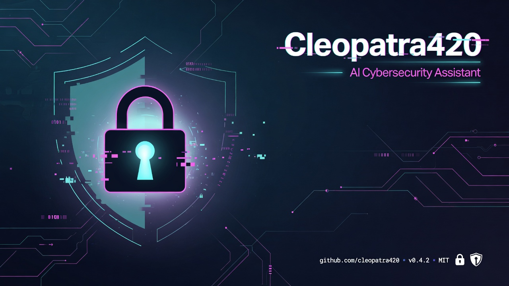

# Cleopatra420 — AI Assisteng de Ciberseguridad

<p align="center">
  
</p>

<p align="center">
  <a href="https://github.com/AndresCaballero0101/cleopatra420-ai-assisteng/stargazers"></a>
  <a href="https://github.com/AndresCaballero0101/cleopatra420-ai-assisteng/blob/main/LICENSE"></a>
  
  
  
</p>

Asistente de **ciberseguridad defensiva** en Python con herramientas locales y chat IA multi-proveedor (**SpaceXAI/xAI, DeepSeek, OpenCloud, OpenAI, OpenRouter** o cualquier API compatible con OpenAI).

> **Uso ético únicamente.** Este proyecto está pensado para proteger sistemas, aprender defensa y hacer análisis legítimos. No incluye exploits ni ayuda a atacar sistemas de terceros.

**Repo:** [github.com/AndresCaballero0101/cleopatra420-ai-assisteng](https://github.com/AndresCaballero0101/cleopatra420-ai-assisteng)

---

## Novedades v1.1.0 — multi-proveedor de IA

Ideal para quienes quieran **probar Cleopatra420 sin atarse a un solo vendor**:

- **Varias API keys**: xAI/Grok, DeepSeek, OpenCloud, OpenAI, OpenRouter o un endpoint **custom** compatible con OpenAI.
- **Config simple**: unifica con `AI_PROVIDER` + `AI_API_KEY`, o pon solo la clave del proveedor (`DEEPSEEK_API_KEY`, `XAI_API_KEY`, …).
- **Auto-detección**: si no eliges proveedor, se usa la primera clave válida encontrada en `.env`.
- **Menú 11 + `/provider`**: ver qué claves tienes y cambiar de proveedor en la sesión (sin recompilar).
- **Sin romper lo anterior**: si ya tenías `XAI_API_KEY`, sigue funcionando igual.
- **Herramientas locales 2–10** siguen operando **sin ninguna API key** (contraseñas, hashes, URLs, secret scan, etc.).
- **Ética defensiva intacta**: el system prompt sigue rechazando exploits, malware e intrusiones no autorizadas.
- **Smoke test** ampliado (`scripts/smoke_test.py`) para validar proveedores y herramientas locales en segundos.

> Cómo testear en 1 minuto: `copy .env.example .env` → pega una clave (p. ej. DeepSeek) → `py -3 main.py` → opción **1** (chat) u opción **11** (estado de proveedores).

---

## Características

| Módulo | Descripción |
|--------|-------------|
| **Chat IA** | Consultas de hardening, phishing, logs y buenas prácticas (xAI, DeepSeek, OpenCloud, OpenAI, OpenRouter o endpoint custom) |
| **Contraseñas** | Generador criptográficamente seguro + análisis de fortaleza/entropía |
| **Hashes** | MD5, SHA-1/256/384/512, BLAKE2 (texto y archivos) + identificación por longitud |
| **URLs** | Heurísticas anti-phishing (IP literal, TLD abusados, suplantación de marca…) |
| **Red** | Info de red local y resolución DNS |
| **Encoding** | Base64 y Hex (encode/decode) para análisis forense ligero |
| **Secret scan** | Detecta API keys, JWT, tokens y claves privadas en texto pegado |
| **Checklist** | Hardening básico de estación de trabajo y cuentas |

### Vista del menú CLI

```
 1  Chat IA de ciberseguridad (multi-proveedor)
 2  Generar contraseña segura
 3  Analizar fortaleza de contraseña
 4  Calcular hash (texto o archivo)
 5  Identificar tipo de hash por longitud
 6  Analizar URL sospechosa (phishing heuristics)
 7  Info de red local / resolver DNS
 8  Codificar / decodificar Base64 o Hex
 9  Escanear texto en busca de secretos filtrados
10  Checklist de hardening básico
11  Ver / cambiar proveedor de IA
 0  Salir
```

---

## Requisitos

- Python **3.10+** (probado con 3.13)
- Windows, Linux o macOS
- (Opcional) API key de **al menos un** proveedor para el chat IA

## Instalación

```bash
# Clonar
git clone https://github.com/AndresCaballero0101/cleopatra420-ai-assisteng.git
cd cleopatra420-ai-assisteng

# Dependencias
py -3 -m pip install -r requirements.txt

# Configurar API (opcional pero recomendado para el chat)
copy .env.example .env   # Windows
# cp .env.example .env   # Linux/macOS
# Edita .env y pega la clave del proveedor que uses
```

## Uso

```bash
py -3 main.py
# o
py -3 -m cleopatra420
# o
py -3 "AI assisteng Cleopatra420.py"
```

### Proveedores de IA soportados

Todos usan el SDK OpenAI (Chat Completions). Elige **uno**:

| Proveedor | Variable de clave | Modelo por defecto | Base URL por defecto |
|-----------|-------------------|--------------------|----------------------|
| **xAI / SpaceXAI** | `XAI_API_KEY` | `grok-4.5` | `https://api.x.ai/v1` |
| **DeepSeek** | `DEEPSEEK_API_KEY` | `deepseek-chat` | `https://api.deepseek.com` |
| **OpenCloud** | `OPENCLOUD_API_KEY` | `gpt-4o-mini` | `https://api.opencloud.ai/v1` *(ajústala a tu endpoint)* |
| **OpenAI** | `OPENAI_API_KEY` | `gpt-4o-mini` | `https://api.openai.com/v1` |
| **OpenRouter** | `OPENROUTER_API_KEY` | `openrouter/auto` | `https://openrouter.ai/api/v1` |
| **Custom** | `CUSTOM_API_KEY` | — | `CUSTOM_BASE_URL` (obligatorio) |

#### Opción A — unificado (recomendado)

```env
AI_PROVIDER=deepseek
AI_API_KEY=tu_clave
AI_MODEL=deepseek-chat
# AI_BASE_URL=https://api.deepseek.com   # solo si quieres sobrescribir
```

Valores de `AI_PROVIDER`: `xai` · `deepseek` · `opencloud` · `openai` · `openrouter` · `custom`

#### Opción B — solo la clave del proveedor

```env
DEEPSEEK_API_KEY=tu_clave
# o XAI_API_KEY=... / OPENCLOUD_API_KEY=... + OPENCLOUD_BASE_URL=...
```

Si no defines `AI_PROVIDER`, se auto-detecta la primera clave disponible (orden: xai → deepseek → opencloud → openai → openrouter → custom).

En el menú, la opción **11** muestra el estado de cada proveedor y permite cambiarlo **solo en la sesión actual**. Para fijarlo de forma permanente, edita `.env`.

**Nota OpenCloud:** muchos servicios “OpenCloud” son APIs compatibles con OpenAI. Si tu panel usa otra URL, ponla en `OPENCLOUD_BASE_URL` o usa `AI_PROVIDER=custom` con `AI_BASE_URL`.

Sin API key puedes usar **todas las herramientas locales** (opciones 2–10).

---

## Estructura del proyecto

```
cleopatra420-ai-assisteng/
├── main.py
├── AI assisteng Cleopatra420.py
├── requirements.txt
├── .env.example
├── .gitignore
├── README.md
├── LICENSE
├── docs/
│   └── banner.jpg
├── scripts/
│   └── smoke_test.py
└── cleopatra420/
    ├── __init__.py
    ├── __main__.py
    ├── config.py
    ├── ai_client.py
    ├── cli.py
    └── tools/
        ├── password_tools.py
        ├── hash_tools.py
        ├── network_tools.py
        ├── url_check.py
        ├── encoding_tools.py
        └── secrets_scan.py
```

---

## Política de seguridad y ética

- Solo opera en **sistemas propios** o con **autorización escrita**.
- El prompt del modelo **rechaza** pedidos ofensivos (exploits, malware, intrusión).
- No subas tu `.env` ni claves reales a Git (ya está en `.gitignore`).
- Si encuentras una vulnerabilidad en este repo, reporta de forma responsable abriendo un [issue](https://github.com/AndresCaballero0101/cleopatra420-ai-assisteng/issues).

---

## Stack

- Python 3  
- [Rich](https://github.com/Textualize/rich) — CLI  
- [OpenAI SDK](https://github.com/openai/openai-python) → APIs compatibles (xAI, DeepSeek, OpenCloud, OpenAI, OpenRouter, custom)  
- `python-dotenv`, `requests`

---

## Topics

`cybersecurity` · `python` · `ai` · `security` · `defensive-security` · `ethical-hacking` · `cli` · `xai` · `grok` · `deepseek` · `openai`

---

## Licencia

MIT — ver [LICENSE](LICENSE).

## Autor

**AndresCaballero0101** — [GitHub](https://github.com/AndresCaballero0101)  
**Cleopatra420 / AI Assisteng** — proyecto de ciberseguridad defensiva.

Si te resulta útil, deja una ⭐ en el repositorio. ¡Gracias!
